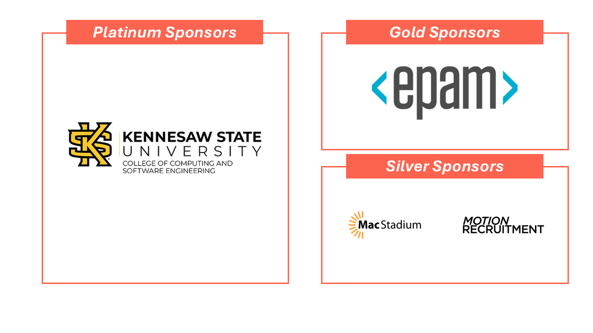
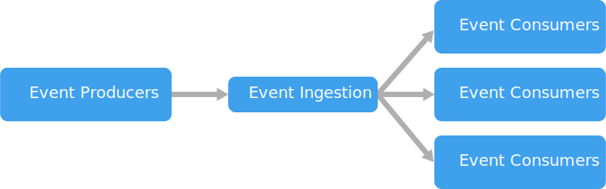
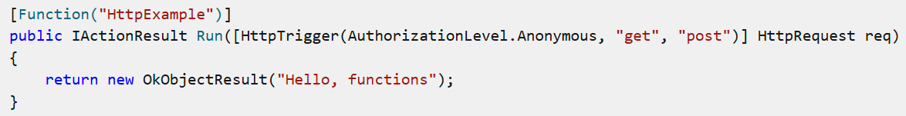
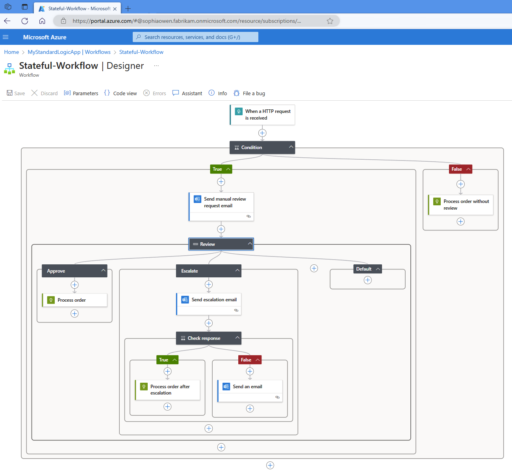

# The State of Serverless: Azure 2025 Edition

with AL Rodriguez

---

---
# Me (AL)

- @ProgrammerAL
- https://ProgrammerAL.com
- Principal Backend Developer at Olympus

---

# What is this session?

- <u>Introduction</u> and Overview to Serverless
  - Conversation
  - No Code
- Overview of Serverless in Azure
  - Pros and Cons
  - Specific Services
- Software Development Perspective*

---

# In the beginning...

* We had physical servers
* Then Virtual Machines
* Then Virtual Machines in co-located spaces
* Then the cloud was created
  * and things got weird

---

# After the cloud...

- More abstractions were added
- IaaS/PaaS
- Serverless was born

---

# What is Serverless?

- Started with Compute
  - Grew to other types of services
- Care about the Servers, less
- High level abstraction over the platform
  - Devs ignore: OS/CPU/Memory/Disk Space/etc

---

# "Serverless" got out of hand

- Became a Buzzword
- Serverless meant everything
- Serverless meant nothing

---

# CNCF Definition of Serverless

* Abstracts servers away from the user
* Underlying software managed by service provider
  - Physical machine, VM, physical security, software updates, SDK/Runtime updates
* Charged by usage
* Provider specific SDK/API/etc
* https://glossary.cncf.io/serverless

---

# Simpler Serverless Definition

- Scales 
  - Down 0, up to "infinity"
- Pay for usage
- Proprietary to the platform

---

# Tradeoffs of Serverless

| Pros      | Cons      |
| ------------- | ------------- |
| Only on when in use | Cold Boot |
| Pay for what you use | Can be more expensive than always-on services |
| Simplified Development Model | Tightly coupled to platform |

---

# Event Driven Architecture

- Thrives off serverless
- Triggered by services

---

# Serverless Types

- Compute
- Storage
- Database

---

# Serverless Compute

* Application Code
  - Written for a custom platform
* Run by a Trigger
  - REST endpoints
  - Event driven

---

# Serverless Compute in Azure

- Azure Functions
- Azure Container Apps
- Azure Logic Apps

---

# Azure Functions

- Scales
  - Scales based on usage
- Pay for usage
  - Pay per invocation*
    - First 1 million free
- Proprietary to the platform
  - Triggers - HTTP, Queue, Database, Event Grid, IoT, and more!
  - Supports different programming languages, based on MS
  - Deployed from - Single code file, zip file, container image

---

---

# Azure Container Apps

- Scales
  - Usage rules to scale
- Pay for usage
  - Pay per invocation, plus CPU/Memory Usage
    - First 180,000 seconds free
- Proprietary to the platform
  - Abstraction over Kubernetes
  - Mainly HTTP Triggers
    - Has some other triggers

---

# Azure Logic Apps

- Scales
  - Scales based on usage
- Pay for usage
  - Consumption Tier, pay per invocation 
- Proprietary to the platform
  - No-Code Platform, build Workflows
    - UI Based
  - Big Feature: Connectors

---

---

# Non-Serverless Compute

* Kubernetes (AKS) and Container Instances (ACI)
  - You manage Pods and Kubernetes Version
* Azure App Service
  - PaaS, pay for hours it's on
  - Abstraction over a VM

---

# Other Types of Serverless Compute

- Javascript functions (Cloudflare, Vercel, everywhere else)
- WebAssembly (Cloudflare, Fermyon)

---

# Serverless Storage

- Azure Storage Accounts
  - Blobs
  - Queue
- Azure Service bus

---

# Blobs

- Scales
  - Scales "forever"
- Pay for usage
  - Cost: storage usage and transactions
- Proprietary to the platform
  - REST API

---

# Queue Storage

- Scales
  - Scales "forever"
- Pay for usage
  - Cost: storage usage and transactions
- Proprietary to the platform
  - REST API
  - It's a queue - 1 reader

---

# Service Bus

- Scales
  - Pay to scale
- Pay for usage
  - Consumption Tier, Pay per transaction
- Proprietary to the platform
  - Also a Queue - Many readers

---

# Serverless Databases

- Azure Managed SQL
- CosmosDB
- Azure Table Storage

---

# Azure Managed SQL Database

- Scales
  - Has a Serverless mode - Scales to 0
- Pay for usage
  - Pay per usage while on, and storage usage
- Proprietary to the platform
  - MS SQL Server - Not proprietary*

---

# CosmosDB

- Scales
  - Scales for cost
- Pay for usage
  - Has a Serverless mode - Flag set when creating
  - Pay per query difficulty, and storage usage
- Proprietary to the platform
  - Custom Azure Document Database
  - Heavily pushed by Microsoft

---

# Azure Table Storage

- Scales
  - Scales "forever" like blobs
- Pay for usage
  - Pay per transaction and storage usage
- Proprietary to the platform
  - Document database
    - Part of Azure Storage
* Fun Fact: HaveIBeenPwned.com used this has DB until very recently

---

# Review

* Serverless Definition
  - Scales
  - Pay for usage
  - Proprietary
* Compute
  - Functions, Container Apps, Logic Apps
* Storage
  - Blobs, Queues, Service Bus
* Database
  - Managed SQL Server, Cosmos DB, Table Storage

---

# Online Info

- @ProgrammerAL
- https://ProgrammerAL.com

