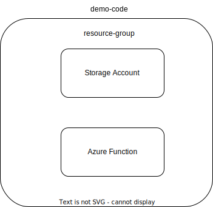

# Azure IaC for Developers with C# and Pulumi

with AL Rodriguez


---

# Me (AL)

- @ProgrammerAL
- ProgrammerAL.com
- Principal Backend Developer at Olympus
- NOT affiliated with Pulumi, Microsoft, or any other company mentioned


---

# What this session is

- Overview of Cloud Infrastructure as Code (IaC) 
  - Specifically for Developers
- Introduction to Pulumi
- Demo with C# and Azure
  - Concepts apply to other languages/clouds

---

# How do you deploy infrastructure?

- Other team handles it?
- Automated/Manual/Mixed?
- CI/CD Pipelines?

---

# Server History Lesson

- Physical hardware
- VMs on physical hardware
- VMs on Co-located hardware
- VMs in a "cloud"
- Cloud with IaaS/PaaS/etc services <--today!

---


---

# Infrastructure as Code (IaC)

- A concept, not a technology
- Usually Desired State Config (DSC)
- Code!
  - Repeatable
  - Create more environments with ease
  - Updated with a PR
  - YAML, JSON, Custom DSL, or Your Choice of Language

---

# Why should devs care?

- Devs know their apps
  - What cloud resources their apps need
  - When the cloud resources need to be added
- Con: More work shifted-left

---

# What do I need to know for Azure IaC?

- Azure
- IaC Tool
- Programming Language of the IaC Tool

---

# IaC Tools for Azure

- Azure ARM/Bicep
- Terraform/OpenTofu
- Pulumi

---

# Azure ARM and Bicep

- Developed by Microsoft
- Custom languages
- Require extensions to do proper development
- ARM Templates - Original
- Bicep - New Hotness

---

# Pulumi (the IaC tool)

- Developed by Pulumi (the company)
- Tooling for Cloud IaC
  - Create/Read/Update/Delete cloud services
- Use your choice or programming language*
  - Procedural code
  - Imperative Runtime aka DSC (Desired State Configuration)
- Supports all major cloud providers
  - Many other providers too!

---
```csharp
using Pulumi;
using Pulumi.AzureNative.Web;
using Pulumi.AzureNative.Web.Inputs;
using System.Collections.Generic;

return await Deployment.RunAsync(() =>
{
    // Create an Azure Resource Group
    var resourceGroup = new Pulumi.AzureNative.Resources.ResourceGroup("myresourceGroup");

    // Create an App Service Plan for the App Service
    var appServicePlan = new AppServicePlan("myappServicePlan", new AppServicePlanArgs
    {
        ResourceGroupName = resourceGroup.Name,
        Location = resourceGroup.Location,
        Kind = "App",
        Sku = new SkuDescriptionArgs
        {
            Name = "B1",
            Tier = "Basic"
        }
    });

    // Create the App Service instance
    var appService = new WebApp("myappService", new WebAppArgs
    {
        ResourceGroupName = resourceGroup.Name,
        Location = resourceGroup.Location,
        ServerFarmId = appServicePlan.Id,
    });

    // Export the App Service URL and the Redis cache primary key
    return new Dictionary<string, object?>
    {
        ["appServiceUrl"] = appService.DefaultHostName.Apply(hostName => $"https://{hostName}"),
    };
});
```
---

# What Pulumi isn't

- NOT an abstraction over clouds
  - Clouds are target specifically
  - Ex: Cloud storage different between AWS S3 and Azure Blob Storage

---

# Demo Time!

- Code
- Pulumi CLI
- Web Portal



---

# Stack Outputs

- Set by You, your code
- Usable in:
  - Stack References
  - `Pulumi.README.md` files

---

# Resource References

- "Get" Functions
- Loaded as Read Only variables

---

#


---

# Pulumi A.I.

- Generate Pulumi Code using that thing everyone's talking about
- https://www.pulumi.com/ai

---

# Online Info

- @ProgrammerAL
- programmerAL.com


