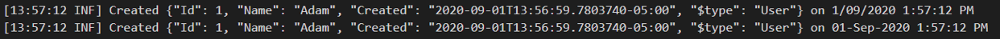
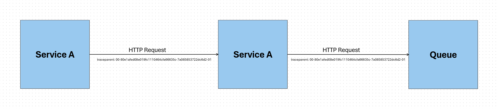
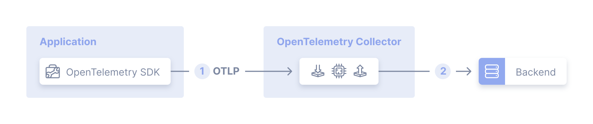

# Intro to OpenTelemetry for Developers

with AL Rodriguez

---

# About Me (AL)

- @ProgrammerAL
- https://ProgrammerAL.com
- Principal Backend Developer at Olympus

---

# What are we talking about?

- What is Observability
- What is OpenTelemetry
- How do we add OpenTelemetry to our code

---

# Why Observability?

* Developers need runtime data to diagnose bugs
* I.T. Operations needs to know metrics like Requests Per Second, CPU and Memory usage
* P.M.s want to know usage statistics
  - Ex: How often a shopping cart is abandoned?

---

# 1957
- Fortran programming language created
- Plain text log messages go to console/text files

---

# 2025+
* More programming languages exist
* Plain text log messages to console/files/3rd party company solution
* Logs have higher verbosity, more data per line
  - Timestamp, log level, JSON output, Thread Id, Request Id, etc

---

# Limitations of Plain Text Logs

* Data in files is hard, and expensive, to sift through
* Hard to combine logs for a distributed application
* 3rd Pary Vendors make this easier
  - Big dependency on the vendor
  - Devs must to learn that vendor's tools
* Example Scenario:
  - UI calls `Service A` which calls `Service B` which calls `Service C`
	- An exception occurs in `Service B` because of response from `Service C`

---

# Azure Application Insights SDK

* Upload Logs
* Upload Metrics
  - Usage patterns, trends, requests per second, etc
* Track Transactions
  - HTTP Requests
  - Custom Events (wrap methods, external dependency calls, etc)

---

# OpenTelemetry (OTel)

- Open standard for collecting telemetry data about distributed services
- Open Source, Vendor Neutral, Language Agnostic
- APIs and SDKs
- https://OpenTelemetry.io

---

# OTel is NOT Logging

- It's Structured data

---

# What kind of does OTel care about?

* Traces
  - Full lifetime of requests in the system
* Metrics
  - Numbers
    - Performance counters/requests per second/etc

---

# OTel Metrics

- Counters
- CPU/Memory usage on the box
- Requests per second

---

# OTel Traces

- Info for a request
- Full lifetime of the request

---

# OTel Trace

---

# Trace Spans

- Traces made up of child Spans
- Spans have child attributes
  - Key/Value pairs of custom data

---

# OTel Traceparent Header

---

# Trace Example

* Trace is created when a request comes into the system
* OTel SDK creates a span when making HTTP call out to 3rd party service
	- OTel SDK adds span atributes like Endpoint, Status Code, etc
* OTel SDK creates a span when calling a database
	- Custom code adds span attributes for the database call like query, runtime, cost
* Custom Code creates custom Span to track important work
  - Adds spans to track user id for a delete operation

---

# OTel SDK - Environment Variables

- Control SDK variables with Environment Variables
- `OTEL_EXPORTER_OTLP_ENDPOINT`
- `OTEL_EXPORTER_OTLP_HEADERS`
- `OTEL_SERVICE_NAME`

---

# Code Demo Time

---

# OTel Collector Agent

- Separate process to push OTel data to provider
- Reccomendation: Push OTel to Collector Agent
  - Agent can batch, do retries, etc

---

# OTel for UI

- Exists!
- Requires more thinking when to start a new Trace
  - For specific operations?
  - When page loads?

---

# In Conclusion

- Everyone cares about observability
- OTel - Greatest Common Denominator
- Traces have Spans have Attributes

